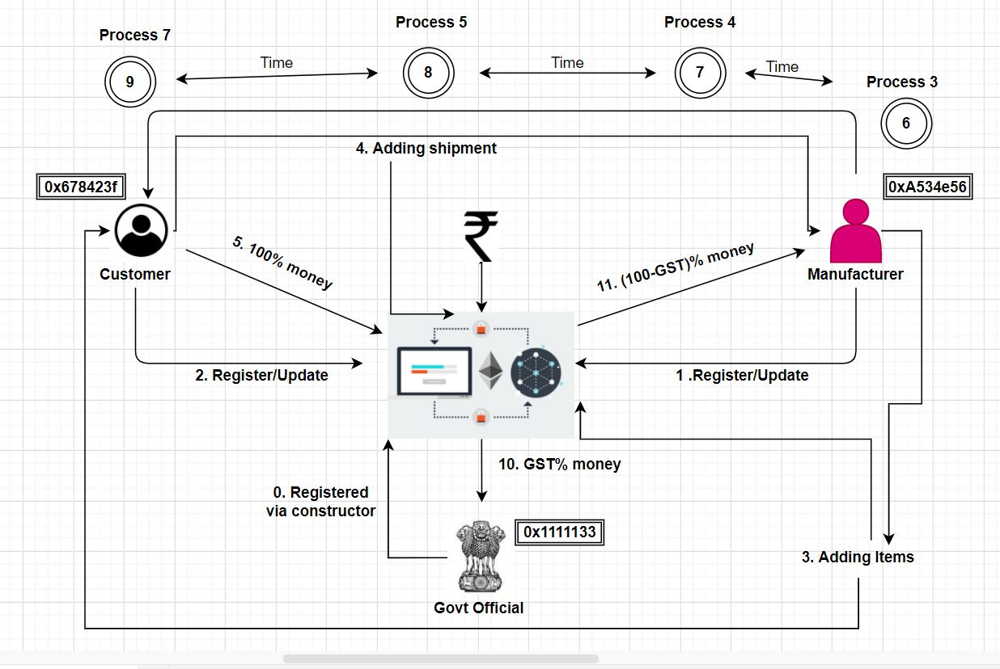
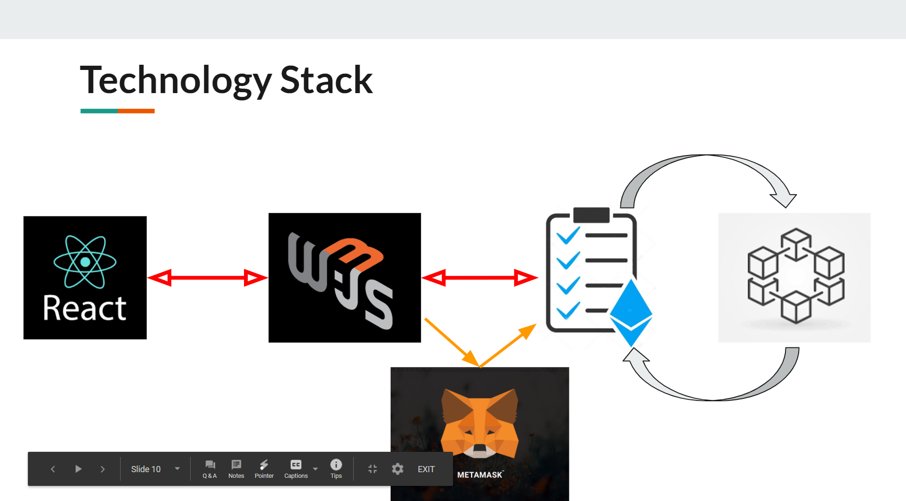

## Team Name: BRIMNET
## Project Name: Process And Lineage Capture Tool

### Project Overview
-------------------------
* Our main objective is to develop an Application to realize the entire process flow and identify its associated dependencies and bottlenecks in the process of Supply Chain. With this project we can detect and diagnose the entire process cycle.
* The proposed solution is an **~~Application~~ Dapplication** running on a distributed computing system having a distributed ledger[DLT] based technology. It has a React-frontend and blockchain coonected to smart-contacts back-end with a crypto-currency[**Metamask**] extension.

### Solution Description
--------------------------
Our area of work is to develop an application that visualises the entire process lineage,mandates unique identity proof of the users,secures the data in a decentralized database and secures the entire transaction process inorder to achieve maximum efficiency and transparency in terms of security of user data through our business model.
We've come up with an application that uses the concept of Smart Contracts facilitated through BlockChain. It uses:
* Ethereum Virtual Machine that deploys and administers smart contracts in the BlockChain.
* Ethereum Ganache that simulates the features of a real Ethereum network & provides a unique address to each user.
* Metamask that is a cryptocurrency wallet that generates passwords and keys on one’s device.
* React.Js that helps to create fast scalable dynamic applications at the front-end
* Web3.Js is a library which integrates frontend with the Ethereum Blockchain.

### Architecture Design
--------------------------
We're attachaing the basic process flow of our business model along with the architecture of the stck we've used to come up with this Application.
 * Process-Flow Diagram 

 * Stack Architecture 

 ### Technical Description
 ---------------------------
 * Technologies Used:
    
      *  **Remix-Etereum IDE** that deploys and administers smart contracts in the BlockChain.
      * **Ethereum Ganache** that simulates the features of a real Ethereum network & provides a unique address to each user.
      * **Metamask** that is a cryptocurrency wallet that generates passwords and keys on one’s device.
      * **React.Js** that helps to create fast scalable dynamic applications at the front-end
      * **Web3.Js** is a library which integrates frontend with the Ethereum Blockchain.

 * SetUp/Installations Required:   
    1. [GitBash](https://git-scm.com/downloads "Click here to download")
    2. [Visual Studio Code IDE](https://code.visualstudio.com/Download "CLick here to download")
    3. [Ethereum Ganache](https://www.trufflesuite.com/ganache "Click here to download")
    4. [Metamask Extension](https://metamask.io/download.html "CLick here to download extension")
    5. [Node.Js](https://nodejs.org/en/download/ "CLick here to download")
 * Instructions to run the submitted code:
    1. Run the GitBash setup followed by Gitbashing on a suitable location of your choice and input the following commands:
    ```
    git clone (https://gitlab.com/kole-swapnil/summer-internship-template-repository)
    cd 'Application Code'
    cd client
    npm install
    npm start
    ```
    2. Open the Application Code folder in your Visual    Code Studio IDE.
    3. Open your Metamask extension and create transaction accounts in Ropsten network to run the transaction process. 

    4. Deploy the code on Remix IDE and you're good to go!
    
    **Our GitHub Repository**: https://github.com/kole-swapnil/Process_Lineage

    **Our Application is hosted at**: https://kole-swapnil.github.io/Process_Lineage


    ### Team Brimnet
    -----------------
    * [Swapnil Kole](https://github.com/kole-swapnil)
    (Email-b118060@iiit-bh.ac.in)

        **Contribution**: Has worked on blockchain and smart contract part of the project. He has programmed the smart contract . He has integrated the react with the smart contracts by web3 and has also integrated the metamask wallet. He has also helped in making the React application. Also helped with figuring out the workflow.

    * [Pooja Das](https://github.com/poojadas07)
     (Email-b418033@iiit-bh.ac.in)

       **Contribution**: Has worked on the frontend part of the project in React . She has created most of the components in react and has also integrated the designs to our applications and came up with some basic algorithms.


    * [Pallavi Mishra](https://github.com/Pallavi241199)
     (Email-b518030@iiit-bh.ac.in)
       
       **Contribution**: Has worked on Documentation, Technical writing,Presentation and proposed the UI design,product state design. Has managed the products state from start to end along with the process flow.


    * [Atipha Mohanty](https://github.com/Atipha)
     (Email-b518014@iiit-bh.ac.in)
    
        **Contribution**: Has worked on Documentation, Technical writing,Presentation and proposed the design of the UI,product state design. Has managed the products state from start to end along with the process flow.